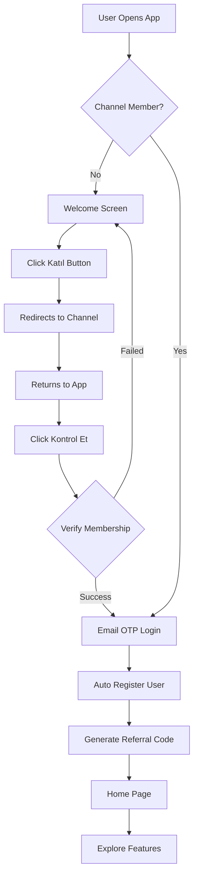

# 🎰 Karaeski - Telegram Mini App Casino Platform

<div align="center">


**Modern casino/betting platform with coin rewards, task system, and interactive games**

[🚀 Live Demo](#) • [📱 Telegram Bot](#) • [📖 Documentation](#telegram-setup)

</div>

---

## ✨ Features

### 🎮 For Users
- **🎰 Playable Casino Games** - Limbo, Dice, Mines with real coin betting
- **💰 Coin Economy** - Earn through tasks, dailies, and referrals
- **🎁 Daily Bonuses** - Claim free coins every 24 hours
- **🎯 Task System** - Complete tasks, submit proof, earn rewards
- **🛍️ User Store** - Purchase items with earned coins
- **👥 Referral Program** - Invite friends, both get +500 coins
- **📊 Profile Stats** - Track earnings, referrals, and achievements
- **🎨 Animated UI** - Confetti, smooth transitions, haptic feedback

### 🔐 For Admins
- **📈 Dashboard** - User stats, revenue, engagement metrics
- **👤 User Management** - View, edit, ban users
- **📢 Notifications** - Broadcast to all/active/new users
- **✅ Task Approvals** - Review submissions with proof URLs
- **🎮 Game Settings** - Configure min/max bets, house edge
- **🛒 Store Management** - Add items, manage stock, pricing
- **🏢 Sponsor Management** - CRUD operations with image uploads
- **⚙️ App Settings** - Telegram bot, channel, bonus configuration

---

## 🎯 Tech Stack

### Frontend
- **React 18** + **TypeScript** + **Vite**
- **Tailwind CSS** + **shadcn/ui** components
- **Zustand** for state management
- **React Router** for routing
- **Lucide Icons**

### Backend (Devv Platform)
- **Authentication** - Email OTP verification
- **Database** - 8 NoSQL tables with real-time sync
- **File Upload** - Image storage for sponsors and store
- **Telegram SDK** - Native Mini App integration

---

## 🚀 Quick Start

### 1. Clone & Install
```bash
git clone <repository-url>
cd karaeski-app
npm install
```

### 2. Development
```bash
npm run dev
```

### 3. Production Build
```bash
npm run build
```

---

## 📱 Telegram Setup

### Step 1: Create Telegram Bot

1. Message [@BotFather](https://t.me/BotFather) on Telegram
2. Send `/newbot` command
3. Follow prompts:
   - Choose bot name (e.g., "Karaeski Casino")
   - Choose username (e.g., "KaraeskiBot")
4. **Save the bot token** (format: `123456789:ABCdefGHIjklMNOpqrsTUVwxyz`)

### Step 2: Create Telegram Channel

1. Create a new Telegram channel
2. Make it public and choose a username (e.g., "@KaraeskiOfficial")
3. Add your bot as channel admin:
   - Go to channel settings → Administrators
   - Click "Add Administrator"
   - Search for your bot
   - Give "Post Messages" permission

### Step 3: Configure App Settings

1. Open your deployed app
2. Navigate to `/admin/login`
3. Login with demo credentials:
   - Email: `admin@karaeski.com`
   - Password: `admin123`
4. Go to **Settings** page
5. Update **Telegram Settings**:
   - Bot Token: Your bot token from Step 1
   - Channel Username: Your channel username (with @)
6. Configure **Reward Settings**:
   - Daily Bonus Amount
   - Referral Bonus
   - Initial Balance
7. Click **Save Settings**

### Step 4: Create Mini App

1. Go back to @BotFather
2. Send `/newapp` command
3. Select your bot
4. Provide app details:
   - Title: "Karaeski Casino"
   - Description: "Win coins, play games, complete tasks!"
   - Photo: Upload 640x360 image
   - GIF/Video: Optional demo
   - Short name: "karaeski" (will be used in URL)
5. Set **Web App URL**: Your deployment URL
6. Click "Done"

### Step 5: Test the App

1. Open your bot chat on Telegram
2. You should see a "Play" button or keyboard button
3. Click to launch the mini app
4. Test flow:
   - Welcome screen appears
   - Click "Katıl" to join channel
   - Click "Kontrol Et" to verify membership
   - Complete OTP login
   - Explore features!

---

## 📊 Database Schema

### 8 Real-time Tables

| Table | Records | Purpose |
|-------|---------|---------|
| `users` | User accounts | Telegram data, coins, referrals |
| `sponsors` | Sponsor sites | Logo, redirect URL, order |
| `store_items` | Store products | Name, price, stock, images |
| `tasks` | Task definitions | Title, reward, type, icon |
| `task_completions` | Submissions | User tasks, proof, status |
| `notifications` | Broadcast history | Title, message, target |
| `game_settings` | Game config | Min/max bets, house edge |
| `app_settings` | App config | Bot token, bonuses, channel |

All tables support real-time CRUD operations via Devv SDK.

---

## 🎮 Available Games

### 1. 🚀 Limbo
**Multiplier Prediction Game**
- Bet coins on target multiplier
- Cash out before crash
- Higher risk = higher reward

### 2. 🎲 Dice
**Number Guessing Game**
- Bet Over or Under target number
- Choose your lucky number
- Roll to win

### 3. 💣 Mines
**Minesweeper Casino**
- Select safe tiles
- Avoid hidden mines
- Cash out anytime

### Coming Soon
- 🗼 Tower Legend
- 💥 Crash
- 🎡 Roulette

---

## 🔐 Admin Panel

Access: `/admin/login`

**Demo Credentials:**
- Email: `admin@karaeski.com`
- Password: `admin123`

**Features:**
- 📊 Dashboard with analytics
- 👥 User management table
- ✅ Task approval system
- 📢 Notification broadcasts
- 🎮 Game settings panel
- 🛒 Store management
- 🏢 Sponsor CRUD
- ⚙️ App configuration

---

## 🎨 Design System

### Theme
- **Primary**: Emerald green casino aesthetic
- **Style**: Modern gradients with smooth animations
- **Typography**: Inter font family
- **Icons**: Lucide React icon set

### Animations
- Confetti celebrations on achievements
- Smooth page transitions
- Floating mascot on welcome screen
- Loading states with skeletons
- Haptic feedback for Telegram native feel

---

## 🏗️ Project Structure

```
src/
├── components/          # Reusable UI components
│   ├── ui/             # shadcn/ui components
│   ├── AdminLayout.tsx
│   ├── AdminSidebar.tsx
│   └── BottomNav.tsx
├── pages/              # Route pages
│   ├── WelcomePage.tsx
│   ├── HomePage.tsx
│   ├── GamesPage.tsx
│   ├── TasksPage.tsx
│   ├── StorePage.tsx
│   ├── ProfilePage.tsx
│   ├── games/          # Game pages
│   │   ├── LimboGame.tsx
│   │   ├── DiceGame.tsx
│   │   └── MinesGame.tsx
│   └── admin/          # Admin panel pages
│       ├── DashboardPage.tsx
│       ├── UsersPage.tsx
│       ├── TasksPage.tsx
│       ├── TaskApprovalsPage.tsx
│       ├── GameSettingsPage.tsx
│       ├── StorePage.tsx
│       ├── SponsorsPage.tsx
│       └── SettingsPage.tsx
├── store/              # Zustand state management
│   ├── auth-store.ts   # User authentication
│   └── admin-store.ts  # Admin session
└── lib/                # Utilities
    ├── telegram.ts     # Telegram SDK wrapper
    └── utils.ts        # Helper functions
```

---

## 🔄 User Flow



---

## 🎁 Referral System

### How It Works
1. **User registers** → Gets unique code `KAR + last 6 digits of Telegram ID`
2. **Share code** → Via Telegram share button or copy link
3. **Friend registers** → Enters referral code during signup
4. **Both get +500 coins** → Instant bonus for both parties

### Tracking
- View referral count in Profile page
- Real-time updates when someone uses your code
- Share via Telegram or copy link

---

## 💰 Coin Economy

### Earning Coins
- 🎁 Daily Bonus: 100-500 coins (configurable)
- 👥 Referrals: 500 coins per successful referral
- ✅ Tasks: Variable rewards (set by admin)
- 🎮 Games: Win from casino games

### Spending Coins
- 🛍️ User Store: Purchase items
- 🎰 Casino Games: Place bets

All transactions are real-time and reflected instantly.

---

## 🛠️ Development

### Environment Variables
Not needed! All configuration via Admin Panel Settings.

### Available Scripts
```bash
npm run dev          # Start development server
npm run build        # Production build
npm run preview      # Preview production build
npm run lint         # Run ESLint
```

### Adding New Features
1. Update database schema if needed (use Devv table tools)
2. Create components in `src/components/`
3. Create pages in `src/pages/`
4. Update routes in `App.tsx`
5. Add to STRUCTURE.md

---

## 📦 Dependencies

### Core
- `react` - UI library
- `react-router-dom` - Routing
- `zustand` - State management
- `@devvai/devv-code-backend` - Backend SDK

### UI
- `tailwindcss` - Styling
- `lucide-react` - Icons
- `canvas-confetti` - Celebrations
- `@radix-ui/*` - shadcn/ui components

---

## 🔒 Security

- ✅ Channel membership verification
- ✅ Email OTP authentication
- ✅ Admin authentication separate from users
- ✅ Protected routes with guards
- ✅ User-scoped database queries
- ✅ Secure file uploads via Devv SDK

---

## 🐛 Troubleshooting

### "Channel verification failed"
- Ensure bot token is correct in Settings
- Verify bot is admin of the channel
- Check channel username includes @ symbol

### "OTP not received"
- Check email spam folder
- Try different email provider
- Verify Devv Auth is configured

### "Images not uploading"
- Check file size < 5MB
- Supported formats: JPG, PNG, WebP
- Verify Devv File Upload SDK is active

### "Admin login not working"
- Use demo credentials: `admin@karaeski.com` / `admin123`
- Clear browser cache and try again
- Check browser console for errors

---

## 📝 License

MIT License - feel free to use for your projects!

---

## 🤝 Contributing

1. Fork the repository
2. Create feature branch (`git checkout -b feature/amazing-feature`)
3. Commit changes (`git commit -m 'Add amazing feature'`)
4. Push to branch (`git push origin feature/amazing-feature`)
5. Open Pull Request

---

## 📞 Support

- **Telegram Channel**: [@YourChannel](#)
- **Issues**: [GitHub Issues](#)
- **Documentation**: [TELEGRAM_SETUP.md](./TELEGRAM_SETUP.md)

---

## 🎉 Credits

Built with:
- [Devv Platform](https://devv.ai) - Backend SDK
- [shadcn/ui](https://ui.shadcn.com) - UI Components
- [Tailwind CSS](https://tailwindcss.com) - Styling
- [Lucide](https://lucide.dev) - Icons

---

<div align="center">

Made with ❤️ for the Telegram Mini App community

[⬆ Back to Top](#-karaeski---telegram-mini-app-casino-platform)

</div>
# yenikaraeski

